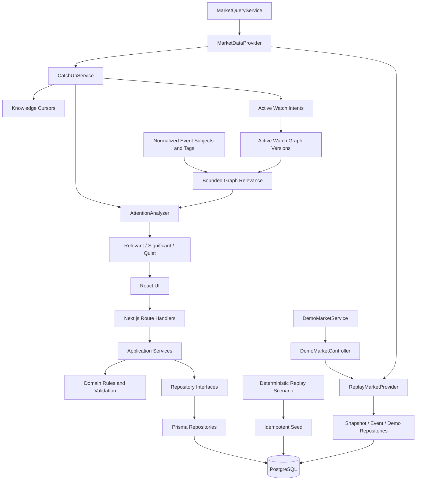

# Architecture

Groww Delta is a modular monolith: one deployable Next.js application with explicit internal boundaries. This keeps local development simple while protecting the domain model from framework, storage, and market-provider details.

## Boundaries

### UI

`src/components` renders DTOs and sends user input through HTTP APIs. It does not access Prisma or replay fixtures. Formatting helpers convert integer paise and normalized timestamps at this boundary.

### Route handlers

`src/app/api` parses query/body data, calls a service, and maps errors to the common JSON envelope. Route handlers contain no watchlist, intent-versioning, or replay rules.

### Application services

`src/server/services` owns use-case rules:

- `WatchlistService`: default-list reads, duplicate prevention, add/archive, and current-sequence cursor baselines
- `WatchIntentService`: payload validation, effective sequence, versioned edit, and archive
- `DemoMarketService`: exact one-step advance, final-step behavior, and cursor-aware reset
- `MarketQueryService`: watchlist snapshots and occurred-event queries
- `InstrumentService`: available instrument queries
- `CatchUpService`: side-effect-free analysis orchestration and explicit acknowledgement
- `WatchGraphService`: curated suggestions plus immutable, market-effective graph versions
- `IntentLifecycleService`: resolution, renewal, keep-watching review, and state-derived timeline queries

### Domain

`src/domain` contains storage-independent rules. The attention analyzer combines cursor windows, snapshots, events, direct intent matches, and bounded Watch Graph matches into one derived item per instrument. Graph validation/traversal and intent lifecycle evaluation have no Prisma, HTTP, React, or replay-fixture dependency.

### Repositories

Repository contracts live in `src/server/repositories/contracts.ts`. Prisma implementations live separately in `prisma-repositories.ts`. Intent supersession plus creation is one database transaction. Cursor advancement uses a conditional database update (`lastSeenSequence < requestedSequence`) and atomically increments its version, so stale acknowledgements cannot regress knowledge.

### Market providers

`MarketDataProvider` defines snapshot, sequence, and event reads. `DemoMarketController` separately defines the persisted scenario control commands. `ReplayMarketProvider` implements both contracts and is the only runtime module that imports replay fixtures. It derives the visible market exclusively from the persisted `DemoSession.currentSequence`; UI and application services never import fixture files.

A future live provider belongs beside `ReplayMarketProvider` and would be selected in `src/server/container.ts`. `CatchUpService` depends only on the provider contract, including bounded snapshot/event reads. Build 2 contains no live-provider code.

## Persistence and concurrency

PostgreSQL is the only source of product state. A partial unique index enforces one active `WatchlistItem` for each watchlist/instrument pair while allowing archived history and later re-addition. Intent and Watch Graph versions keep immutable predecessor links. Graph nodes and edges are relational and loaded through repositories. `KnowledgeAcknowledgement` retains audit history while `KnowledgeCursor` remains current monotonic state. Attention items are not stored: they are reproducibly derived from market facts, active intent/graph versions, and cursor state.

Graph traversal is bounded to three edges and 25 visited nodes. A normalized event subject is authoritative when present; tags provide fallback matching for events without a subject. This lets removal of a specifically tracked subject take effect without a broader context tag silently restoring it.
