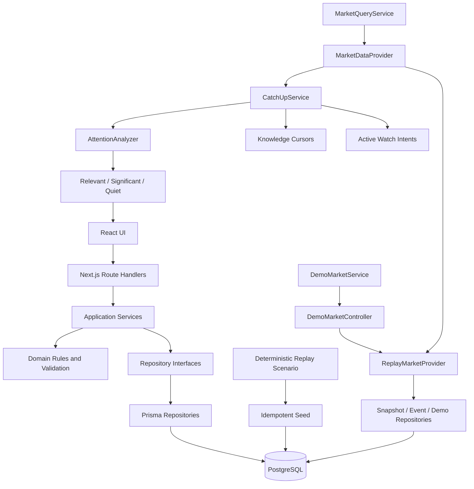

# Architecture

Groww Delta is a modular monolith: one deployable Next.js application with explicit internal boundaries. This keeps local development simple while protecting the domain model from framework, storage, and market-provider details.

## Boundaries

### UI

`src/components` renders DTOs and sends user input through HTTP APIs. It does not access Prisma or replay fixtures. Formatting helpers convert integer paise and normalized timestamps at this boundary.

### Route handlers

`src/app/api` parses query/body data, calls a service, and maps errors to the common JSON envelope. Route handlers contain no watchlist, intent-versioning, or replay rules.

### Application services

`src/server/services` owns use-case rules:

- `WatchlistService`: default-list reads, duplicate prevention, add/archive, and current-sequence cursor baselines
- `WatchIntentService`: payload validation, effective sequence, versioned edit, and archive
- `DemoMarketService`: exact one-step advance, final-step behavior, and cursor-aware reset
- `MarketQueryService`: watchlist snapshots and occurred-event queries
- `InstrumentService`: available instrument queries
- `CatchUpService`: side-effect-free analysis orchestration and explicit acknowledgement

### Domain

`src/domain` contains storage-independent types, discriminated Zod schemas, intent presentation summaries, and the Build 2 attention analyzer. The analyzer combines cursor windows, snapshots, events, and structured intent matches into derived per-instrument lanes. It has no Prisma, HTTP, React, or replay-fixture dependency.

### Repositories

Repository contracts live in `src/server/repositories/contracts.ts`. Prisma implementations live separately in `prisma-repositories.ts`. Intent supersession plus creation is one database transaction. Cursor advancement uses a conditional database update (`lastSeenSequence < requestedSequence`) and atomically increments its version, so stale acknowledgements cannot regress knowledge.

### Market providers

`MarketDataProvider` defines snapshot, sequence, and event reads. `DemoMarketController` separately defines the persisted scenario control commands. `ReplayMarketProvider` implements both contracts and is the only runtime module that imports replay fixtures. It derives the visible market exclusively from the persisted `DemoSession.currentSequence`; UI and application services never import fixture files.

A future live provider belongs beside `ReplayMarketProvider` and would be selected in `src/server/container.ts`. `CatchUpService` depends only on the provider contract, including bounded snapshot/event reads. Build 2 contains no live-provider code.

## Persistence and concurrency

PostgreSQL is the only source of product state. A partial unique index enforces one active `WatchlistItem` for each watchlist/instrument pair while allowing archived history and later re-addition. Intent versions have a unique `(logicalIntentId, version)` key, a self-reference to the previous row, and atomic version transitions. Attention items are not stored: they are reproducibly derived from persisted market facts, active intent versions, and cursor state.
